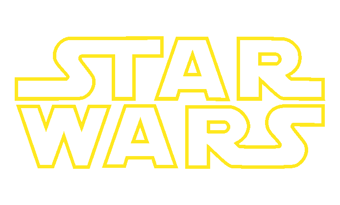

<p align="center">
  
</p>

# Star Wars Autocalls

Proyecto de regresión tabular para estimar `avg_duration_months`, la duración media simulada de un
producto autocallable, a partir de la información disponible al cotizar una RFQ.

El repositorio incluye un flujo reproducible de validación, features point-in-time, experimentación y
entrenamiento, además de un artefacto CatBoost versionado, una API FastAPI y una demo Streamlit.


## Inicio rápido

Requisitos: Python 3.11 o superior y [`uv`](https://docs.astral.sh/uv/).

```bash
uv sync --all-extras
uv run starwars-autocalls validate-data
uv run starwars-autocalls predict --input sample_payload.json
```

El último comando usa el modelo incluido en `artifacts/` y realiza una predicción local sin HTTP.

## API y demo local

Inicia la API:

```bash
uv run starwars-autocalls serve --host 127.0.0.1 --port 8000
```

Swagger estará disponible en <http://127.0.0.1:8000/docs>. En otra terminal puedes iniciar la demo,
que consume esa API:

```bash
uv run streamlit run app/streamlit_app.py --server.port 8501
```

La interfaz estará en <http://127.0.0.1:8501>.

## Docker Compose

Para levantar FastAPI, Streamlit, MLflow y la documentación:

```bash
docker compose up --build
```

| Servicio | URL |
| --- | --- |
| API y Swagger | <http://127.0.0.1:8000/docs> |
| Streamlit | <http://127.0.0.1:8501> |
| MLflow | <http://127.0.0.1:5050> |
| MkDocs | <http://127.0.0.1:8001> |

Los puertos se pueden cambiar copiando `.env.example` a `.env`. Para detener los servicios:

```bash
docker compose down
```

## Entrenamiento

La configuración seleccionada está congelada en `config/final_model.json`. `train` reentrena el
modelo, evalúa el resultado sobre el conjunto de prueba final y guarda el artefacto servido junto con
sus métricas:

```bash
uv run starwars-autocalls train
```

Para evaluar el artefacto existente sin reentrenarlo:

```bash
uv run starwars-autocalls evaluate
```

La suite experimental completa es costosa. Sus etapas, variantes y salidas están descritas en la
[guía de entrenamiento](docs/usage/training.md).

## Documentación

MkDocs contiene el detalle que se mantiene fuera de este README:

- [Definición del problema y objetivos](docs/problem.md);
- [Dataset](docs/data/overview.md);
- [Preprocesamiento](docs/data/preprocessing.md);
- [Validación](docs/methodology/validation.md);
- [Comparación de modelos](docs/experiments/model-comparison.md);
- [Modelo final](docs/results/final-model.md);
- [Arquitectura](docs/architecture.md);
- [Instalación](docs/usage/installation.md);
- [Entrenamiento](docs/usage/training.md);
- [Inferencia](docs/usage/inference.md).

Para consultarla en local:

```bash
uv run mkdocs serve
```

## Desarrollo

Instala los hooks una vez y ejecútalos antes de commitear:

```bash
uv run pre-commit install
uv run pre-commit run --all-files
```

GitHub Actions repite estas comprobaciones principales en cada `push` y `pull request`.

```bash
uv run ruff check src tests scripts
uv run ruff format --check src tests scripts
uv run pytest
uv run mkdocs build --strict
```
