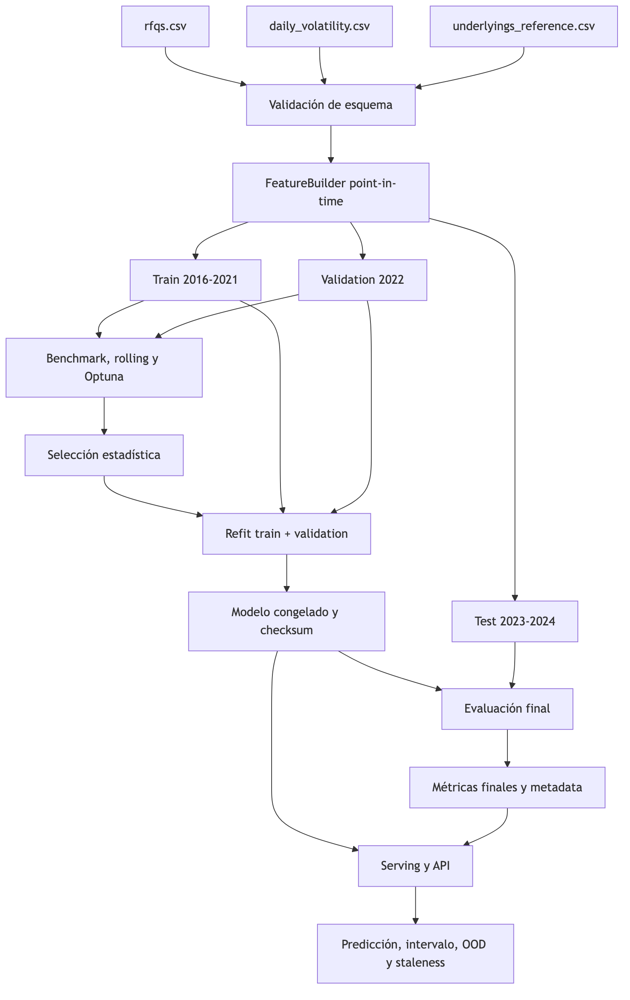
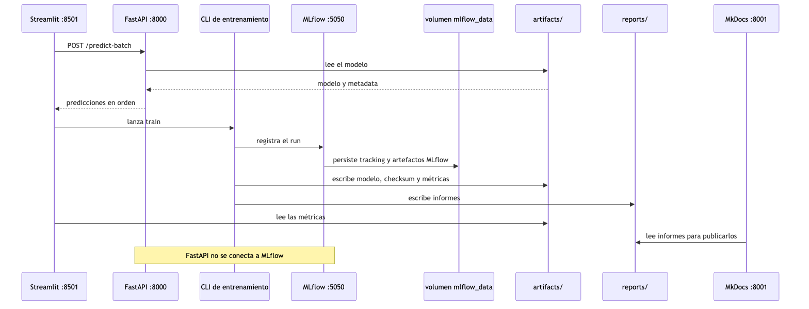

# Arquitectura

## Flujo extremo a extremo



La frontera central es la separación entre experimentación y serving. Los experimentos producen
evidencia y resultados; sólo `train` escribe el artefacto que consume la API.

## Capas

| Capa | Módulos | Responsabilidad | No debe hacer |
| --- | --- | --- | --- |
| Configuración | `config.py` | Resolver rutas, logging y MLflow desde la raíz | Contener lógica de negocio |
| Datos | `data/loading.py`, `data/schemas.py`, `data/validation.py` | Carga, tipos e invariantes entre fuentes | Crear features o seleccionar modelos |
| Features | `features/builders.py` | Parseo de cesta, joins as-of y transformaciones deterministas | Consultar observaciones futuras |
| Modelado | `modeling/specs.py`, `benchmark.py`, `tuning.py`, `selection.py`, `training.py` | Candidatos, evaluación, tuning, selección y refit | Mezclar reportes con serving |
| Reportes | `reports/` | EDA, drift, errores, resumen e interpretabilidad | Modificar el artefacto servido |
| Observabilidad | `observability/` | Rich, structlog y MLflow | Convertir fallos silenciosamente en éxito |
| Serving | `serving/prediction.py`, `modeling/artifacts.py` | Integridad, carga, features de inferencia y predicción | Reentrenar |
| API | `api/main.py` | Contrato HTTP, códigos y documentación OpenAPI | Duplicar lógica del builder |
| CLI | `cli/` | Orquestar casos de uso y presentar resultados | Implementar algoritmos de modelado |

## Estructura del paquete

```text
src/starwars_autocalls/
  api/                    Endpoints FastAPI
  cli/                    Comandos de datos, experimentos, reportes y modelo
  data/                   Carga, esquemas Pandera y validación cruzada
  features/               FeatureBuilder y catálogo de bloques
  modeling/               Specs, métricas, benchmark, tuning, selección y artefactos
  observability/          Logs estructurados, progreso Rich y MLflow
  reports/                EDA, drift, error analysis y SHAP
  serving/                Adaptación del payload y predicción
```

## Artefacto de serving

`model.joblib` contiene el pipeline fitted, el histórico de volatilidad necesario para joins as-of, la
referencia estática y metadata de serving. El fichero separado `model_metadata.json` permite inspección
sin deserializar Joblib. `model.joblib.sha256` se verifica antes de cargar.

La metadata incluye:

- estrategia, familia, especificación, encoding y manifest de features;
- split, métricas y tiempos;
- calibración conformal y clipping;
- productos, tickers, rangos y staleness aceptados;
- hashes de datos, lockfile y dependencias;
- run de MLflow y contexto de apertura de test.

## Observabilidad

La CLI combina salida Rich para seguimiento humano y structlog para eventos. MLflow registra runs padre
y anidados de trials, parámetros, métricas, datasets y modelos. La identidad se separa en:

| Campo | Ejemplo | Uso |
| --- | --- | --- |
| Run name | `catboost_tuned__all_without_noise__best` | Lectura del experimento concreto |
| `model_name` | `catboost_tuned__all_without_noise` | Especificación exacta |
| `model_family` | `catboost` | Agrupación y registered model |
| Dataset | `all_without_noise__validation` | Features y partición |
| Segmento | `global`, `single`, `worst_of` | Estrategia de datos |
| Protocolo | Holdout, rolling, tuning, final | Comparabilidad de métricas |

## Servicios locales



`compose.yaml` asigna un puerto local distinto a cada interfaz. Streamlit llama a FastAPI para inferencia
y lanza la CLI para entrenar; sólo esa CLI registra el entrenamiento en MLflow. FastAPI se limita a leer
el modelo servido y no se conecta a MLflow. MkDocs publica los informes generados y MLflow conserva su
historial en un volumen independiente.

## Reproducibilidad y seguridad

El entorno queda bloqueado con `uv.lock`; los resultados tabulares se persisten bajo `reports/`. Las
figuras analíticas se regeneran con `scripts/generate_documentation_assets.py` y los diagramas Mermaid,
con `scripts/generate_documentation_diagrams.sh`. Tests comprueban esquemas, features, artefactos, API,
tracking y hash del lockfile.

El periodo de desarrollo termina en 2022. Los años desde 2023 constituyen el holdout final y sólo
`train` y `evaluate` calculan sus métricas. `evaluate` no reentrena. La API nunca ejecuta training y
rechaza artefactos ausentes, corruptos o incompatibles.
