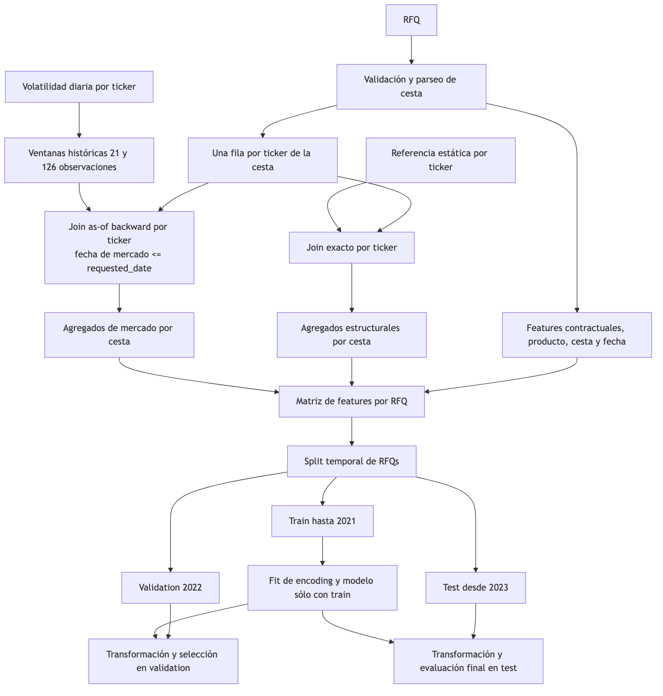

# Preprocesamiento

## Flujo point-in-time

- Para cada ticker de la cesta se busca su volatilidad histórica más reciente disponible antes o exactamente en la fecha de cotización (requested_date).
- Las ventanas de 21 y 126 observaciones calculan estadísticas sobre los últimos 21 o 126 registros históricos de ese ticker, no sobre datos futuros.
- Las tendencias miden cómo ha evolucionado la volatilidad dentro de esas ventanas.
- FeatureBuilder aplica exactamente las mismas reglas al entrenar el modelo y al generar predicciones nuevas, evitando diferencias entre entrenamiento e inferencia.

## Variables derivadas principales

- Contrato: madurez nominal, tiempo callable, intervalo de observación, número estimado de
  observaciones, gap y ratios de barrera.
- Producto: tipo de producto, tipo de cesta y bucket de madurez.
- Cesta: tamaño, firma canónica, multi-hot de 14 tickers, 91 parejas, sectores, concentración,
  extremos de volatilidad y proxies `worst_of`.
- Mercado: agregados de volatilidad realizada, tendencia, z-score, cambios y spreads frente a
  volatilidad implícita y estructural.
- Fecha: año, mes y trimestre de solicitud en bloques diagnósticos.

El catálogo se genera desde `src/starwars_autocalls/features/builders.py`. Las familias expandidas se
representan como `underlying_<ID>` para los 14 indicadores de ticker y `pair_<ID1>_<ID2>` para las 91
parejas.

### Inventario de variables

--8<-- "docs/includes/feature-catalog.md"

### Inventario de bloques

--8<-- "docs/includes/feature-blocks.md"

## Tratamiento categórico

El encoding pertenece al pipeline y se ajusta sólo con train:

| Familia | Tratamiento |
| --- | --- |
| CatBoost | Categóricas nativas como texto |
| LightGBM | Categóricas nativas con dtype `category` |
| HistGradientBoosting y XGBoost ordinal | `OrdinalEncoder` con desconocidos controlados |
| Ridge y ExtraTrees | One-hot con categorías desconocidas ignoradas |

## Variables excluidas

`executed`, `avg_duration_months` y `rfq_id` nunca son features. `counterparty` y `trader_id` sólo
aparecen en ablaciones diagnósticas y se excluyen de `all_without_commercial` y del bloque final
`all_without_noise`. Su posible señal es comercial, inestable y propensa a memorizar identidades.

`all_without_noise` elimina además diez candidatas históricas con señal débil o inestable:
`requested_month`, `requested_quarter`, `notional_credits`, `log_notional_credits`, varios spreads de
volatilidad y `no_call_observation_count`. El nombre refleja una decisión experimental, no una prueba
de que las variables sean ruido universal.

## Ausencias y valores desconocidos

Las fuentes actuales cumplen las columnas obligatorias. Los pipelines numéricos imputan medianas y los
categóricos disponen de tratamiento de desconocidos. En la API se rechazan tickers sin referencia,
mercado inexistente o mercado con más de diez días de antigüedad. Los valores numéricos fuera del rango
observado activan una advertencia OOD cuando siguen siendo válidos según el contrato del esquema.

## Límites contractuales de la salida

La predicción productiva se recorta al intervalo
`[máximo(no-call, intervalo de observación), madurez nominal]`.

En validation, el clipping redujo el MAE de 3,0832 a 3,0670 meses. La evaluación principal de modelo
mantiene la métrica cruda para comparar candidatos de forma homogénea; serving devuelve la versión
contractualmente acotada.
