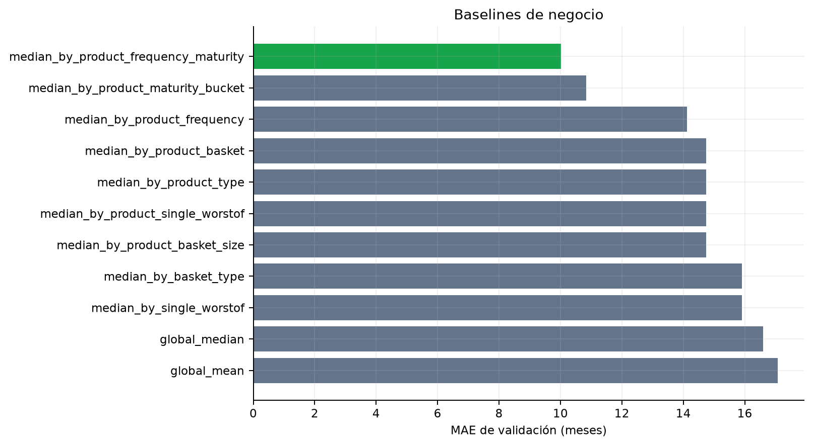

# Baseline

## Objetivo

Los baselines responden cuánto se gana frente a reglas que una mesa podría implementar sin un modelo
complejo. Todos se ajustan con las 9.807 filas de train y se evalúan sobre las 1.578 de validation de
2022.

La mejor regla calcula la mediana por producto, frecuencia de observación y madurez. Si una combinación
no existe en train, el regresor aplica fallback a agrupaciones más generales y finalmente a la mediana
global.

## Resultados completos

--8<-- "docs/includes/baseline-table.md"

## Lectura

La mediana global obtiene MAE 16,5934 meses. Añadir producto, frecuencia y madurez reduce el MAE a
10,0206, una mejora del 39,6 % frente a la mediana global. El resultado confirma que el calendario
contractual contiene señal sustancial antes de incorporar mercado o modelos no lineales.

El mejor CatBoost sin tuning alcanza 3,2684 meses, un 67,4 % menos que el mejor baseline de negocio en
validation. La comparación es homogénea porque ambos usan el mismo corte y target.

## Límites

Las reglas de mediana son robustas y fáciles de explicar, pero producen predicciones escalonadas y no
capturan interacciones continuas entre barreras, no-call, volatilidad y composición de cesta. Su tiempo
de predicción incluye el pipeline completo y no debe compararse con una consulta SQL especializada.
