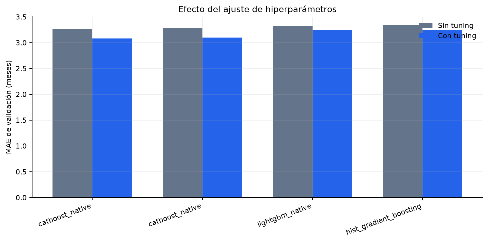

# Ajuste de hiperparámetros

## Protocolo

Optuna minimiza MAE de validation con `TPESampler(seed=31415)`. El tuning se ejecuta después del
benchmark y sólo sobre candidatos competitivos. Cada estudio tiene un máximo de trials y un timeout de
300 segundos por modelo; por eso CatBoost completó 22 y 21 trials en dos estudios globales aunque el
presupuesto solicitado era 25.

Los espacios incluyen:

- CatBoost: iteraciones, profundidad, learning rate, regularización L2, random strength y temperatura
  de bagging.
- LightGBM: estimadores, learning rate, hojas, mínimo de muestras, subsampling, columnas y
  regularización L1/L2.
- HistGradientBoosting: iteraciones, learning rate, hojas, mínimo de muestras, bins y L2.
- XGBoost: estimadores, learning rate, profundidad, peso mínimo, subsampling, columnas y L1/L2.

No se ajusta sobre test ni se utiliza el resultado final de 2023–2024 para detener estudios.



## Resultados completos

--8<-- "docs/includes/tuning-table.md"

Los tiempos marcados con `≈` son la duración aproximada del run de tuning registrado en MLflow; se
incluyen como referencia de coste de ejecución y no como tiempo exacto del ajuste final.

## Resultado global

CatBoost con `all_without_noise` mejora de 3,2684 a 3,0832 meses, una reducción de 0,1852 meses o 5,7 %.
El mejor trial utiliza:

```text
iterations=737
depth=6
learning_rate=0.0767494619
l2_leaf_reg=3.8024913874
random_strength=1.4557129110
bagging_temperature=0.2483088432
```

La receta `all_without_commercial` ajustada queda a 0,0190 meses. LightGBM y
HistGradientBoosting también mejoran, pero no superan al CatBoost elegido.

## Resultado segmentado

En `single`, CatBoost ajustado obtiene MAE 3,4613; en `worst_of`, CatBoost alcanza 2,9409. La media
ponderada de ambos modelos es 3,1170. El global ajustado logra 3,0832 sobre las mismas 1.578 filas de
validation, por lo que la segmentación no mejora ese corte.
