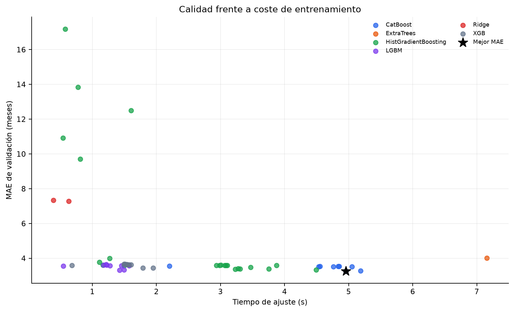

# Comparación de modelos

## Diseño experimental

El benchmark global cruza familias, encodings y bloques de features. Cada fila ajusta el pipeline desde
cero en train 2016–2021 y calcula métricas en validation 2022. El orden de la tabla es MAE ascendente.

La comparación reporta calidad, tiempo de ajuste, tiempo batch de predicción y dimensionalidad. Los
tiempos son mediciones locales de una única ejecución: sirven para comparar candidatos en este entorno,
no como garantía de latencia productiva.

## Mejores candidatos por familia

| Familia | Modelo | Features | Encoding | MAE | RMSE | R² | MedAE | Ajuste (s) |
| --- | --- | --- | --- | ---: | ---: | ---: | ---: | ---: |
| CatBoost | `catboost_native__all_without_noise` | `all_without_noise` | Nativo | 3,2684 | 4,6828 | 0,9528 | 2,2745 | 4,957 |
| LightGBM | `lightgbm_native__all_without_noise` | `all_without_noise` | Nativo | 3,3215 | 4,8618 | 0,9492 | 2,2241 | 1,426 |
| HistGradientBoosting | `hist_gradient_boosting__all_without_noise` | `all_without_noise` | Ordinal | 3,3385 | 4,6369 | 0,9538 | 2,4163 | 4,492 |
| XGBoost | `xgboost_ordinal__all_without_noise` | `all_without_noise` | Ordinal | 3,4474 | 4,7943 | 0,9506 | 2,4724 | 1,789 |
| ExtraTrees | `extra_trees_onehot` | `all_without_commercial` | One-hot | 4,0070 | 5,6485 | 0,9314 | 2,7806 | 7,156 |
| Ridge | `ridge_onehot` | `all_without_commercial` | One-hot | 7,2862 | 9,5774 | 0,8027 | 5,7894 | 0,630 |

CatBoost obtiene el menor MAE, mientras que HistGradientBoosting logra el mejor RMSE entre las cuatro
familias de boosting principales. LightGBM ofrece la mejor relación simple entre tiempo de ajuste y
MAE. La ventaja de CatBoost sobre LightGBM es 0,0532 meses antes de tuning: pequeña, pero consistente con
el mejor tratamiento de las variables categóricas de producto y composición.

## Ablación de features

`all_without_noise` es el mejor bloque de CatBoost, LightGBM, HistGradientBoosting y XGBoost en el
holdout 2022. Frente a `all_without_commercial`, la mejora de CatBoost es sólo 0,0127 meses; por tanto,
la ablación se considera evidencia incremental, no una demostración de que cada variable retirada sea
ruido.

Los bloques aislados de contrato, producto, cesta o mercado quedan lejos de las recetas combinadas. El
patrón confirma que la duración depende a la vez de términos contractuales, composición y contexto de
volatilidad.

## Mejores resultados rolling por familia

La siguiente tabla muestra el mejor candidato de cada familia en cinco folds anuales expansivos. La
selección se realiza por el menor MAE medio de los folds; la desviación estándar y el máximo muestran la
variabilidad y el peor resultado observado.

| Familia | Mejor candidato | Features | Encoding | MAE medio | Desv. estándar | Máximo |
| --- | --- | --- | --- | ---: | ---: | ---: |
| HistGradientBoosting | `hist_gradient_boosting__global_stable_tail` | `global_stable_tail` | Ordinal | 4,0651 | 1,0001 | 5,6517 |
| CatBoost | `catboost_native__global_stable_no_sector` | `global_stable_no_sector` | Nativo | 4,0821 | 1,1943 | 5,8780 |
| XGBoost | `xgboost_ordinal__global_stable_tail` | `global_stable_tail` | Ordinal | 4,1018 | 0,9946 | 5,6094 |
| LightGBM | `lightgbm_native__global_stable_tail` | `global_stable_tail` | Nativo | 4,1770 | 1,1721 | 6,0587 |
| ExtraTrees | `extra_trees_onehot` | `all_without_commercial` | One-hot | 4,7047 | 1,0469 | 6,3289 |
| Ridge | `ridge_onehot` | `all_without_commercial` | One-hot | 7,7048 | 0,6036 | 8,6165 |
| Medianas agrupadas | `median_by_product_frequency_maturity` | `all_without_commercial` | One-hot | 10,1098 | 0,1394 | 10,3396 |

HistGradientBoosting obtiene el menor MAE rolling medio, seguido de CatBoost y XGBoost. CatBoost sigue
siendo competitivo y ofrece categorías nativas, mientras que las medianas agrupadas y Ridge quedan
claramente por detrás como referencias simples.

## Conclusión

El rolling muestra que los modelos de boosting son claramente superiores a las referencias simples y
que sus resultados son relativamente próximos entre sí. Aunque HistGradientBoosting obtiene el mejor
MAE medio en los folds, CatBoost ofrece el mejor resultado del holdout 2022 y un tratamiento nativo de
las categorías. Por ello, se mantiene CatBoost como candidato final y se reserva el conjunto test para
la auditoría posterior a la selección.
