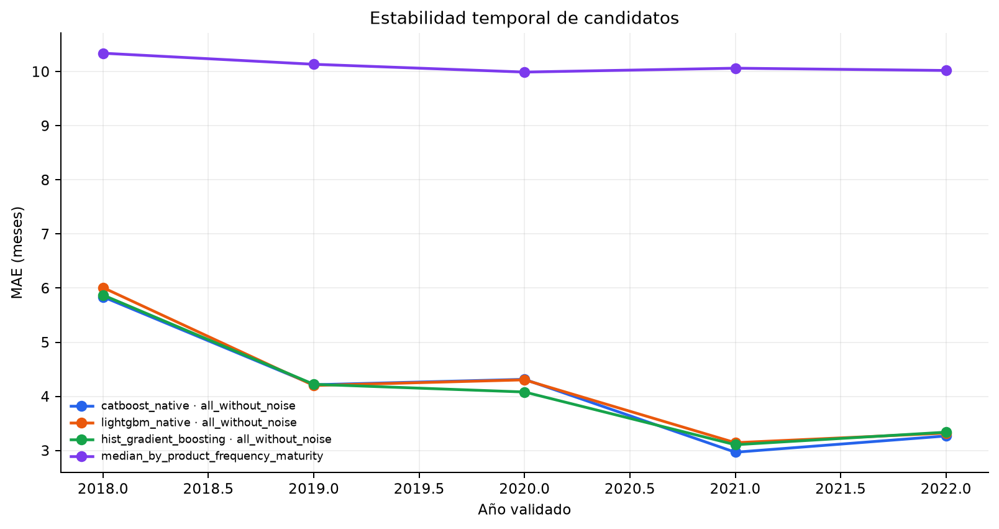

# Validación

## Separación temporal

| Partición | Periodo | Filas | Uso permitido |
| --- | --- | ---: | --- |
| Train | 2016–2021 | 9.807 | Ajuste de candidatos y transformadores |
| Validation | 2022 | 1.578 | Selección, tuning, clipping y calibración |
| Test | 2023–junio 2024 | 2.411 | Auditoría final tras congelar la decisión |

El orden temporal reproduce el caso de uso: entrenar con pasado y predecir RFQs posteriores.

El código dispone de un fallback cronológico 70/15/15 si los años esperados no existen, pero no se
activa con estos datos.

## Validación rolling

Se utilizan cinco folds anuales expansivos, con años de validation de 2018 a 2022. En cada fold, el
train contiene únicamente años anteriores. El procedimiento vuelve a ajustar features, encoding y
modelo para cada corte.

Rolling no reemplaza el holdout 2022: aporta una distribución temporal del error y revela candidatos
cuya buena métrica puntual depende de un único año. Tampoco toca 2023–2024.

## Comparación estadística de estrategias

| Evidencia | Global − segmentada | IC 95 % | Conclusión |
| --- | ---: | --- | --- |
| Bootstrap por trimestre en validation | −0,0339 meses | [−0,0812; 0,0155] | No significativo; el punto favorece global |
| Bootstrap por fila, diagnóstico | −0,0339 meses | [−0,1119; 0,0434] | No significativo |
| Bootstrap sobre cinco folds rolling | 0,0179 meses | [−0,0443; 0,0910] | No significativo; el punto favorece segmentada |

La evidencia no alcanza significación. La regla predefinida elige
la estrategia global por menor complejidad.
