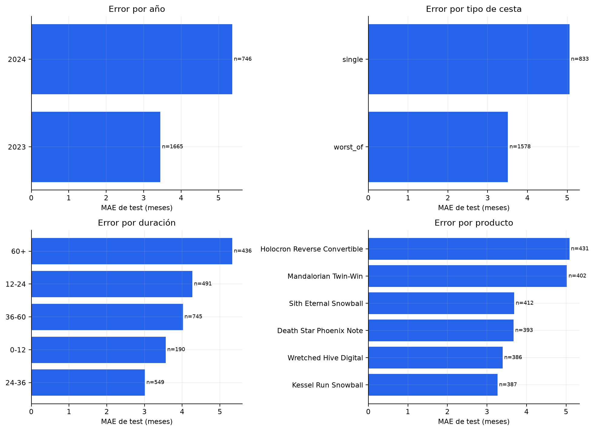

# Análisis de errores

El análisis utiliza exclusivamente las 2.411 predicciones del artefacto final sobre test. No selecciona
el modelo ni modifica sus parámetros.

## Desglose temporal

| Año | MAE | Filas |
| --- | ---: | ---: |
| 2023 | 3,4478 | 1.665 |
| 2024, hasta junio | 5,3677 | 746 |

El aumento de 1,92 meses en 2024 es la señal de riesgo más importante. Puede reflejar cambio de régimen,
composición o una relación target-features distinta; con medio año de datos no se puede separar esas
causas. Se recomienda monitorización mensual y reentrenamiento condicionado a evidencia de drift y
target maduro.

## Tipo de cesta y producto

| Segmento | MAE | Filas |
| --- | ---: | ---: |
| `single` | 5,0532 | 833 |
| `worst_of` | 3,5080 | 1.578 |

Los dos productos `single` son los más difíciles: `Holocron Reverse Convertible` obtiene MAE 5,0830 y
`Mandalorian Twin-Win` 5,0213. Entre los `worst_of`, `Kessel Run Snowball` es el mejor con 3,2654 y
`Sith Eternal Snowball` el peor con 3,6865.

La diferencia no basta por sí sola para servir modelos segmentados. El modelo `single` especializado no
mejoró la estrategia global en la comparación emparejada y mostró más variabilidad rolling por tener
menos observaciones.

## Duración

| Bucket del target | MAE | Filas |
| --- | ---: | ---: |
| 0–12 meses | 3,5630 | 190 |
| 12–24 meses | 4,2719 | 491 |
| 24–36 meses | 3,0104 | 549 |
| 36–60 meses | 4,0189 | 745 |
| Más de 60 meses | 5,3292 | 436 |

La cola superior es la más difícil en error absoluto. Además de tener más margen para errores grandes,
puede concentrar productos con vencimientos largos y autocall menos probable. Conviene complementar el
MAE global con alertas específicas para duraciones superiores a 60 meses.

## Causas plausibles

- No hay precios, retornos ni correlaciones dinámicas para representar el riesgo conjunto real.
- El mercado se resume con volatilidad; shocks y dirección del subyacente no están observados.
- El intervalo 2024 es parcial y puede corresponder a otro régimen temporal.
