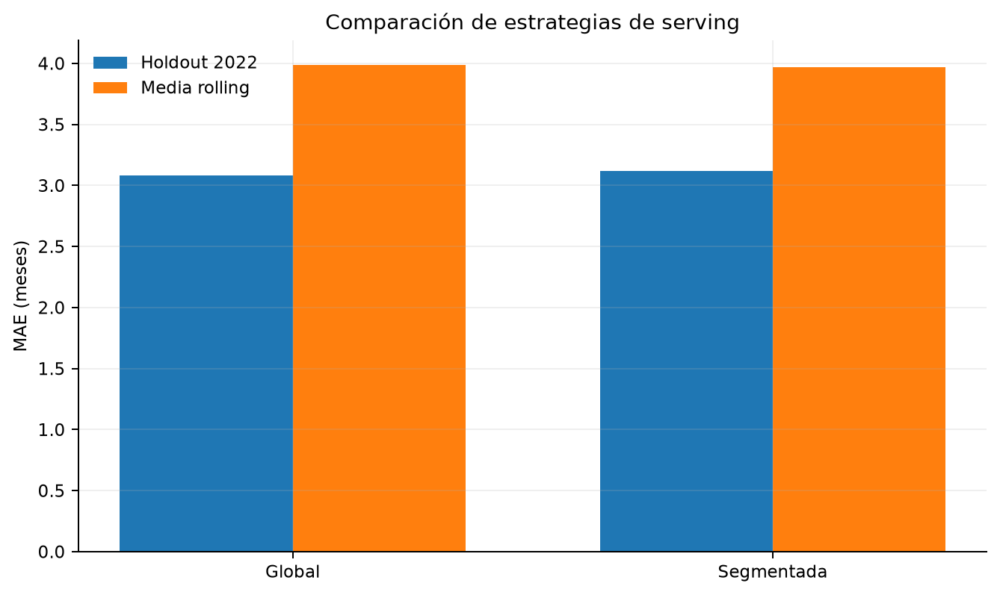
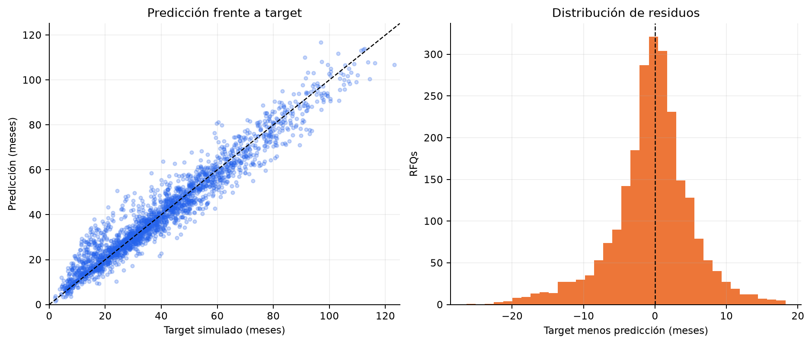

# Modelo final

## Decisión

La estrategia servida es un CatBoost global ajustado con `all_without_noise`. La alternativa segmentada
combina CatBoost específicos para `single` y `worst_of`, pero no demuestra una mejora significativa ni
material.



--8<-- "docs/includes/strategy-table.md"

El intervalo bootstrap por trimestre para `MAE global − MAE segmentada` es
[−0,0812; 0,0155] meses. Incluye cero y la diferencia puntual de −0,0339 favorece ligeramente al global.
La regla de selección elige la solución más simple.

## Auditoría final sobre test

--8<-- "docs/includes/final-model-table.md"

El ajuste final utiliza las 11.385 filas de train y validation. Sólo después se abre el holdout de 2.411
RFQs. La subida desde MAE 3,0832 en validation a 4,0418 en test confirma degradación temporal y
justifica no presentar validation como rendimiento esperado de producción.



La nube permanece próxima a la diagonal en la mayor parte del rango, pero la dispersión aumenta en
duraciones largas. Los residuos no son perfectamente simétricos y justifican reportar RMSE, buckets de
duración e intervalos, además del MAE agregado.

Frente al mejor baseline de negocio, el modelo reduce el MAE de validation de 10,0206 a 3,0832 meses,
una mejora relativa del 69,2 %. No se calcula esta comparación en test porque los baselines no se
promovieron ni evaluaron sobre el holdout final en el artefacto vigente.

## Postprocesamiento e intervalo

La predicción se limita al intervalo permitido por el contrato: desde la primera observación callable
hasta la madurez nominal. En validation, este ajuste reduce el MAE de 3,0832 a 3,0670 meses sin empeorar
las demás métricas principales.

El modelo también calcula un margen de ±7,2563 meses alrededor de cada predicción. Este margen está
diseñado para cubrir el 90 % de los casos; en la calibración cubrió el 90,05 %. Cuando se aplica el límite
contractual, el intervalo tampoco puede salir del rango permitido.

## Rendimiento operativo

| Medida | Valor |
| --- | ---: |
| Tamaño del artefacto | 2,40 MiB |
| Ajuste final | 12,443 s |
| Comando completo de training | 153,266 s |
| Predicción batch de test | 0,112 s |
| Throughput batch | 21.549 filas/s |

El tiempo total incluye carga, validación, preparación, calibración, evaluación, persistencia y tracking.
El throughput no sustituye una prueba HTTP con concurrencia.

## Artefactos

```text
artifacts/model.joblib
artifacts/model.joblib.sha256
artifacts/model_metadata.json
reports/model_evaluation/final_test_metrics.csv
reports/model_evaluation/operational_metrics.json
```

La metadata registra versión del paquete, modelo, features, encoding, split, métricas, calibración,
clipping, rangos de entrenamiento, hashes de las tres fuentes, hash de `uv.lock`, versiones de
dependencias y run de MLflow. El checksum actual del modelo es
`41ebcce02434ad3d7213e0bbd2c7136cf36e81e7365be468edc8fc2d35684bf1`.

## Dictamen

- El modelo funciona bien con estos datos: explica aproximadamente el 93,73 % de la variación de la duración (R² = 0,9373).
-Se equivoca unos 4 meses de media, sobre duraciones medias de unos 40 meses.
-Sin embargo, funciona peor con datos de 2024, posiblemente porque las condiciones han cambiado.
-También predice peor los productos single.
-Depende bastante de reconocer productos y subyacentes concretos, por lo que podría funcionar peor con productos nuevos o poco parecidos a los históricos.
