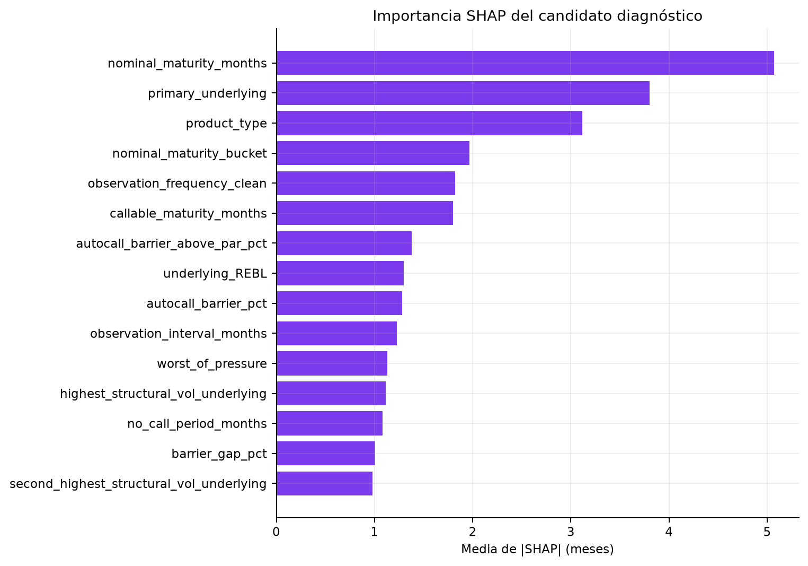
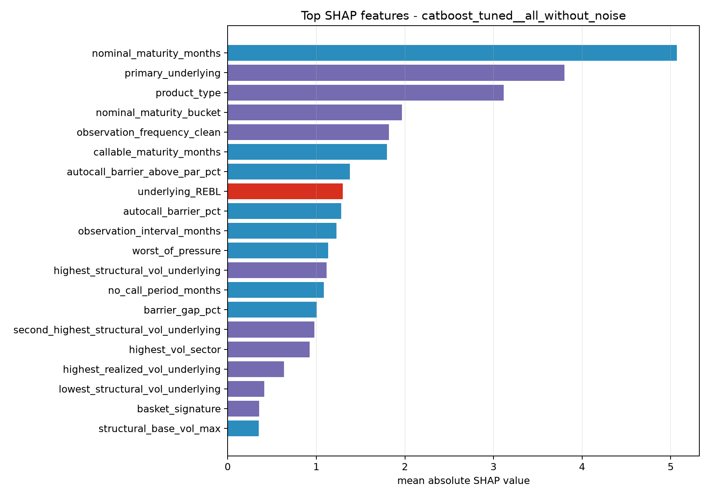

# Interpretabilidad

## Método

Se calculan valores SHAP nativos de CatBoost sobre 1.000 filas y el mismo modelo ajustado y bloque
`all_without_noise` seleccionados. El comando de explicación reentrena el candidato con train para
obtener un modelo compatible con SHAP.





## Variables dominantes

| Rango | Variable | Tipo | Media de \|SHAP\| | Lectura |
| ---: | --- | --- | ---: | --- |
| 1 | `nominal_maturity_months` | Numérica | 5,0697 | A mayor vencimiento, mayor duración posible |
| 2 | `primary_underlying` | Categórica | 3,8022 | Identidad del subyacente o marcador `MULTI` |
| 3 | `product_type` | Categórica | 3,1154 | Resume estructuras contractuales no capturadas por completo |
| 4 | `nominal_maturity_bucket` | Categórica | 1,9684 | No linealidad por tramos de madurez |
| 5 | `observation_frequency_clean` | Categórica | 1,8209 | Más oportunidades de observación cambian la duración |
| 6 | `callable_maturity_months` | Numérica | 1,7983 | Ventana efectiva posterior al no-call |
| 7 | `autocall_barrier_above_par_pct` | Numérica | 1,3775 | Barreras más exigentes retrasan el autocall |
| 8 | `underlying_REBL` | Indicador | 1,2965 | Efecto histórico específico del ticker |
| 9 | `autocall_barrier_pct` | Numérica | 1,2803 | Término directo de cancelación |
| 10 | `observation_interval_months` | Numérica | 1,2296 | Menor frecuencia reduce oportunidades de autocall |

Para las variables numéricas de madurez, barrera, intervalo y presión `worst_of`, la correlación entre
valor y contribución SHAP es positiva y alta, entre 0,87 y 0,96. La dirección tiene sentido: contratos
más largos, barreras más altas, observaciones más separadas y cestas más exigentes tienden a aumentar la
duración estimada.

## Interpretación de negocio

La madurez nominal es la variable más influyente porque marca el tiempo máximo del contrato. El producto,
la frecuencia de observación, el periodo *no-call* y la barrera también afectan a las oportunidades de
autocall y, por tanto, a la duración estimada. En las cestas `worst_of`, `worst_of_pressure` y las
variables de volatilidad indican una mayor exigencia cuando participan varios subyacentes o aumentan sus
niveles de riesgo, aunque su influencia es secundaria frente a la madurez y a la identidad del producto.

La identidad del subyacente también tiene peso. Puede recoger diferencias históricas reales, pero también
memorizar patrones del dataset. Por ello, los resultados para tickers nuevos o composiciones poco
frecuentes deben considerarse de mayor riesgo. Estas lecturas describen cómo utiliza el modelo las
variables; no demuestran relaciones causales ni garantizan estabilidad en otros periodos.

## Qué no demuestra SHAP

- No establece causalidad.
- No valida el origen económico del target simulado.
- No convierte los indicadores de pareja en correlaciones observadas.
- No garantiza estabilidad temporal de las importancias.
- No justifica eliminar una variable sólo por importancia baja; una ablación requiere el mismo protocolo
  temporal.

Para reproducir el análisis:

```bash
uv run starwars-autocalls explain \
  --model-name catboost_native__all_without_noise \
  --max-rows 1000
```
